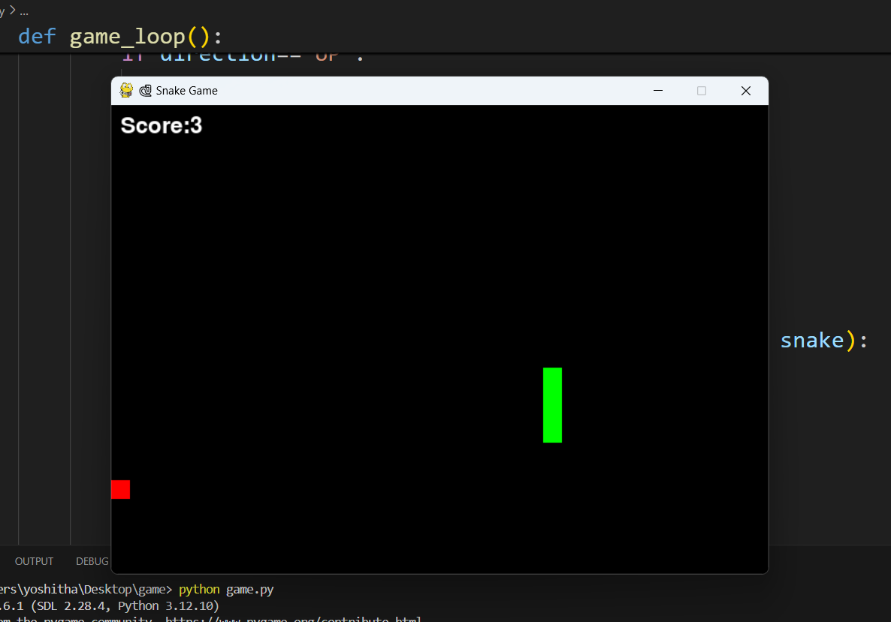

# 🐍 Snake Game
A simple yet classic Snake Game built using Python and Pygame. It recreates the nostalgic Snake game experience with smooth movement, colorful visuals, and real-time scoring. The snake grows in length each time it eats food, making the game progressively more challenging. It’s a fun beginner-friendly project to understand game loops, collision detection, and keyboard event handling in Pygame.

---

## ✨ Features

- 🎮 Classic Snake mechanics with real-time movement  
- 🍎 Randomly spawning food blocks  
- 🧮 Live score display on the screen  
- 🚧 Wall and self-collision detection for game over  
- 🕹️ Responsive and intuitive arrow-key controls  
- 🌈 Clean interface with bright colors
---

## ⚙️ Installation and Setup

### 1. Clone or download this repository

```
git clone https://github.com/yoshithaa25/game.git
```

### 2. Navigate to the project folder

```
cd snake-game
```

### 3. Install dependencies

Make sure Python 3.x is installed, then install Pygame:

```
pip install pygame
```

### 4. Run the game

```
python game.py
```

---
## 🎮 Controls

| Key | Action |
|-----|---------|
| ⬆️ | Move Up |
| ⬇️ | Move Down |
| ⬅️ | Move Left |
| ➡️ | Move Right |
---

## 🧠 How It Works

- The game starts with a single-block snake on the screen.  
- The snake continuously moves in the current direction.  
- The player changes its direction using arrow keys.  
- When the snake eats the red food, its length increases by one block and the score increases by 1.  
- The game ends if the snake hits a wall or runs into its own body.  
- The final score is displayed when the game is over.
---

## 🖼️ Example Output

Below is an example of the game window when it’s running:



The game shows a green snake on a black background with red food blocks. The snake grows and the score updates when it eats food. The game ends if the snake hits the walls or itself.

---


